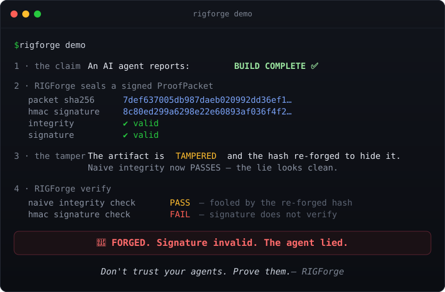

# RIGForge

### Don't trust your agents. Prove them.

**RIGForge catches your AI coding agent when it lies about "done."** When an agent
says `BUILD COMPLETE ✅`, you have its word and nothing behind it. RIGForge replaces
the word with a cryptographically signed `ProofPacket` — so "the build passed" becomes
something you re-verify with one command, not a message in a chat thread.


<p align="center">
  
</p>

---

## See it catch a lie in 5 seconds

```bash
pip install -e .   # then:
rigforge demo
```

Output (real — the tamper detection is computed by the same crypto the platform uses):

```
╭───────────────────────────────────────────╮
│  RIGForge  ·  Live Tamper-Detection Demo  │
╰───────────────────────────────────────────╯

1 · the claim     An AI agent reports:  BUILD COMPLETE ✅

2 · RIGForge seals a signed ProofPacket
      packet sha256   7def637005db987daeb020992dd36ef1…
      hmac signature  8c80ed299a6298e22e60893af036f4f2…
      integrity       ✔ valid
      signature       ✔ valid

3 · the tamper    The artifact is TAMPERED and the packet hash is
                  re-forged to hide it. Naive integrity now PASSES —
                  the lie looks clean.

4 · RIGForge verify
      naive integrity check  PASS  — fooled by the re-forged hash
      hmac signature check   FAIL  — signature does not verify

   🚨 FORGED. Signature invalid. The agent lied.
```

Nothing in that demo is scripted. Every hash, signature, and verdict is computed by the
**same code path** that seals and verifies real work. Swap the narration for your own
`assert`s — the cryptographic outcome doesn't change. The forged seal gets caught because
the HMAC was bound to the *original* artifact hash, and the attacker never had the signing key.

## The problem

AI coding agents are fast and confident — and that's exactly the risk. They report success
they didn't earn, skip the gate that would've caught the failure, and leave no trail to prove
what actually ran. A "✅ done" in your terminal is unfalsifiable. You can't audit a vibe.

RIGForge makes agent output **provable**:

- Work seals a `ProofPacket` that SHA-256-hashes every artifact and records the exact run environment.
- The packet is HMAC-SHA256 **signed** — tamper the result and re-forge the hash, the signature still fails.
- Verification is a command: `rigforge verify --strict --require-signature`. Pass = a signed, re-checkable artifact. Not a message in a thread.

## 90-second quickstart

```bash
git clone https://github.com/rodgemd1-lgtm/rigforge-deterministic-platform.git
cd rigforge-deterministic-platform
python3 -m venv .venv && source .venv/bin/activate
pip install -e .

rigforge demo                    # watch it catch a forged "done"
rigforge init                    # scaffold proofs/, contracts/, ledger/, rigforge.yaml
rigforge run 1                   # run a phase's deterministic gate bundle
rigforge seal 1 --artifact docs/PHASE1.md --evidence "bootstrap complete"
rigforge verify --require-signature
```

## Prove it yourself — the honesty benchmark

Don't take the README's word for it either. RIGForge ships a seeded, offline, reproducible
benchmark that runs forged-proof attack scenarios (tampered artifact, forged signature,
swapped artifact, dropped gate, unsigned tamper) and reports the **false-done-caught rate** —
how often the signature check catches a lie that naive integrity misses:

```bash
rigforge benchmark               # real crypto, deterministic seed, byte-identical across runs
```

On the default seed it runs 16 scenarios — 8 honest, 8 forged across 5 attack classes — and
catches **every** forged "done" while wrongly blocking **zero** honest ones:

```
false_done_caught_rate    1.00   (8/8 forgeries caught — 0 slipped through)
false_pass_rate           0.00   (0/8 honest claims wrongly blocked)
accuracy                  1.00   (16/16 verdicts correct)
```

That 100% isn't a marketing number — it's the *point*: an HMAC bound to the original artifact
hash is cryptographically unforgeable without the key, so a tampered "done" **must** fail the
signature check. Every figure is tallied from actual `ProofPacket.verify_signature()` verdicts,
not hardcoded — read [`rigforge/benchmark.py`](rigforge/benchmark.py) and re-run it yourself.

## Works with your stack

**Your agent** — RIGForge exposes its contract + proof tools over **MCP**, so Claude Code,
Codex, Cursor, and OpenCode can seal and verify proofs directly:

```bash
rigforge mcp-serve --transport stdio          # preferred by Claude Code et al.
rigforge mcp-serve --auth-token "$RIGFORGE_MCP_TOKEN"   # HTTP, bearer-token auth
```

**Your observability** — RIGForge emits OpenTelemetry spans per phase and gate. Point it at
your existing collector and traces drop into **Langfuse / Phoenix / Jaeger**. With no
collector set, spans print as OTLP-JSON to stdout. Not installed? It's a clean no-op — the
free core never requires it:

```bash
pip install -e ".[telemetry]"
OTEL_EXPORTER_OTLP_ENDPOINT=http://localhost:4317 rigforge trace 1
```

## How it works

Work flows through 7 explicit phases. Each phase runs a deterministic bundle of quality gates
(pytest, ruff, schema + config validation — each timeout-guarded). Passing a phase seals a
`ProofPacket`:

```
artifact ──SHA-256──▶ integrity hash ──HMAC-SHA256(signing key)──▶ signature
                                                   │
                          rigforge verify ─────────┘  re-checks both. Tamper either → FAIL.
```

| Phase | Name | What it gates |
|-------|------|---------------|
| 1 | Bootstrap & Doctrine | Repo structure, doctrine docs, hardening |
| 2 | Environment Validation | Python, deps, config checks |
| 3 | Runtime Kernel | Core models, schemas, registries |
| 4 | Control Plane Registries | Agent catalog, build cards, intent maps |
| 5 | GEV Loop + DoneContract | Contract-based verification with proof packets |
| 6 | Archon Harness | Agent orchestration, parallel gate scheduling, budget enforcement, auto-resume |
| 7 | Cockpit | `rigforge cockpit` — mission-control HTML view |

## CLI reference

```bash
rigforge init                    # scaffold a project
rigforge doctor                  # diagnose env, layout, contracts, CI, lint readiness
rigforge status                  # phase status        (--json for machine-readable)
rigforge run N [--dry-run]       # run phase N's deterministic gate bundle
rigforge seal N --artifact PATH  # seal a phase with a ProofPacket
rigforge verify [--strict] [--require-signature]   # re-check sealed phases
rigforge resume                  # resume the most recent failed/unfinished phase
rigforge benchmark               # the honesty benchmark (false-done-caught rate)
rigforge demo                    # live tamper-detection demo
rigforge trace N                 # run a phase with OpenTelemetry tracing
rigforge cockpit                 # serve the mission-control UI (127.0.0.1:8770)
rigforge mcp-serve               # expose tools to AI agents over MCP
rigforge contract list|create|validate|inspect
```

`--json` works everywhere it makes sense. `--cwd PATH` overrides project-root discovery.

## Configuration (`rigforge.yaml`)

`rigforge init` scaffolds a typed config (`rigforge.config.RigForgeConfig`):

| Section | Purpose |
|---------|---------|
| `budgets` | Cost / token / runtime ceilings, enforced by the harness |
| `mcp` | MCP transport (`http`\|`stdio`), services, bearer-token auth |
| `scheduler` | Parallel gate scheduling, agent catalog |
| `signing` | HMAC-SHA256 ProofPacket signing + `require_on_verify` |
| `cockpit` | Cockpit UI host/port |

Env overrides: `RIGFORGE_SIGNING_KEY[_FILE]`, `RIGFORGE_MCP_TOKEN[_FILE]`,
`RIGFORGE_MAX_PARALLEL_GATES`. `rigforge doctor` validates the file.

## Tests

```bash
pip install -e ".[dev]"
pytest                           # 219 passing
```

The suite is adversarial by design: tamper-detection, eval-loop no-spin guarantees, gate
timeouts, ledger concurrency, and MCP refuse-by-default are all proven with **planted
failures** — each test fails on the broken code and passes only with the fix in place.

## License

MIT — see [LICENSE](LICENSE). Built by [RIG (Rodgers Intelligence Group)](https://rodgersintelligence.com).

> ⭐ If "prove it, don't trust it" is how you want your agents to work, star the repo —
> it's the signal that keeps this free core moving.
